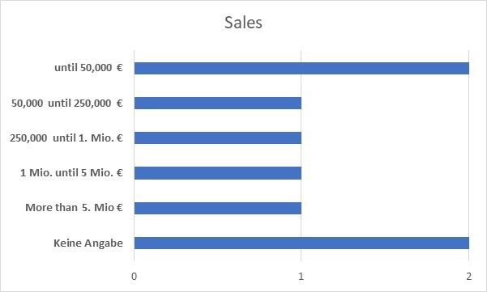

# Analysis of the interviews: State of User Experience in SMEs

````
Timeframe                19/04/2022 – 30/04/2022 
Number of interviewees   8 
Languages                German & Arabic 
Roles of interviewees    UI/UX Designer, Software Developer, Investor, CEO, etc.
Industries               Hotel Industry, Cosmetics, Industry Mechanical Engineering, Clothes and Shoes, etc.
Locations of SMEs        Germany (5), Tunisia (2) and Turkey (1)
Duration                 30-45 Minutes
Meetings                 Remote
Acquisition              LinkedIn, (previous) professional experiences, personal acquaintances, etc.

````

In the digital age, small and medium-sized enterprises (SMEs) face particular challenges. They want their product range to reach as many customers as possible. Conversely, customers want digital solutions to be easy to use and offer a good user experience (UX). The term "UX" refers to all the effects that using a user interface has on a user before, during and after use.
If the user had a positive UX, they would likely be satisfied and recommend the company to others as well as repurchase. For this reason, a value should be placed on the UX by companies.
The purpose of these interviews is to learn about SMEs' current approach to UX and the barriers to identifying and optimizing UX smells. Among other things, it was hypothesized that SMEs do not have the resources (technical, human, financial) to deal with UX comprehensively. Based on the interviews, an attempt was made to prove this hypothesis.
This file consists of two parts:

1. [Analysis of the interviews](#analysis-of-the-interviews)
2. [Listing of relevant UX smells](#listing-of-relevant-ux-smells)

and serves as a gratitude for participating and conducting the interviews on the part of the interviewees.
If you have any questions or uncertainties, please feel free to contact me.
You can reach me at the email address st167263@stud.uni-stuttgart.de.

## Analysis of the interviews

### General questions about the companies and the respondents

Based on the two following figures, the companies surveyed could be classified as SMEs.




In order to ensure a generalization of the findings, several industries and respondents with different roles in the company were addressed.

### Causes for lack of analysis and evaluation of UX in SMEs


The starting point was that SMEs do not deal with UX analyses and evaluations because they lack various resources. As shown in the figure above, high costs are the central obstacle for 75% of the respondents. In addition, 62% of respondents are unable to perform UX analysis and evaluation because they lack technical knowledge in UX and the issues involved. 50% of the respondents emphasize that the limited number of employees and few human resources are the reasons for not performing UX evaluations.

As it can be seen in the figure below, 75% of the SMEs surveyed do not have a role responsible for UX. This again suggests that on the one hand human or technical and on the other hand financial resources are a hurdle for the SMEs when it comes to UX analysis and optimization


Nonetheless, some SMEs strive to optimize UX despite the various obstacles. When asked whether and with which tools user behavior is recorded on the store, the following figure emerged:


On the one hand, about 38% of respondents do not use tracking tools because, for example, they have a business-to-business (B2B) operation and do not foresee normal buyers. One of the other reasons was that they do not know that they are allowed and able to record user behavior for data protection reasons. On the other hand, Google Analytics and Matomo are used, but the analysis of the recorded data rarely takes place because as shown in Fig. 3, there is a lack of technical knowledge.

However, when SMEs have the capacity to analyze and optimize UX, their approach is usually to analyze the data from the tracking tools and then try to reconstruct the problems (e.g., pages with high bounce rate) to find out the trigger and eliminate it afterwards. Some set up KPIs and NPSs to evaluate the optimization and make it measurable.

Due to the fact that most users and shoppers are on their cell phones nowadays, the question was asked whether the design of the online stores was responsive. This was the case for about 88% of the respondents.

Accessibility is also a topic that was addressed. It was noteworthy that none of the companies interviewed had designed their online stores to be barrier-free. However, this was justified by the fact that, on the one hand, the people concerned have special devices and equipment, which makes every website accessible, and, on the other hand, the lack of time and the high costs associated with the small target group were not worthwhile, as well as the industry dependencies were decisive.

## listing of relevant UX smells

### Large page load times

The page load time of a website is important because it contributes to a positive UX, a good SEO ranking factor and conversion rate optimization. A [statistic](https://websitebuilder.org/blog/user-experience-stats) from the first quarter of 2022 shows that 53% of website visitors leave the website if it takes longer than three seconds to load. For Google, a good page load time is the one that takes less than 2.5 seconds. For example, the files and the images can affect the page load time badly.

### Unresponsive Design

Responsive web design or responsive design is an approach to web design that aims to ensure websites display well on a variety of devices and window or screen sizes, from the smallest to the largest display size, to ensure usability and satisfaction. A [statistic](https://websitebuilder.org/blog/user-experience-stats), from the first quarter of 2022, shows that 57% of users will refuse to recommend a company with a poor mobile website if the design of the web pages does not adapt to the size of the device. Moreover, 74% of users are likely to return to a website if it is mobile-friendly.

### Inappropriate / Bad search results

The search function is so bad that only the word literally is searched and thus a small typo does not lead to results with similar terms, but to an empty search, which is not user-friendly. However, sometimes the search for a certain brand may include results from other brands, which can be frustrating for the user. Consequently, the SEO ranking factor deteriorates and the bounce rate increases. A [Google statistic](https://websitebuilder.org/blog/user-experience-stats) from the first quarter of 2022 shows that 61% of users try to visit another website if they cannot quickly find what they are looking for.

### Broken links / 404 pages

A broken link is a link on a website that no longer works because, for example, the page has been removed, but a reference to it (external to Idealo, for example) still exists. The broken links can affect the UX on a website and lead to higher bounce rates.
