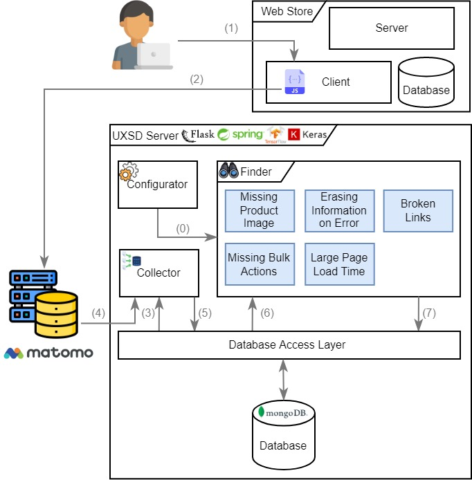

# Recognition process of UXSD

## General Process

The process for automatic recognition is based on three sequential steps.
First, collecting user interaction data with the online store, then processing and aggregating this data and finally automatically recognizing the following UX Smells:

## Detailed Process

The process is illustrated in the following figure:

0. Configuration for the detection settings.
1. With Matomo already integrated, the user interacts with the online shop.
2. User interaction is stored in the Matomo servers.
3. The Collector fetches the last stored ID in the database.
4. The Collector retrieves the new recorded data from Matomo servers.
5. The Collector stores the fetched data in the database.
6. The Finder retrieves the raw data from the database.
7. After the Finder has analyzed the visits for the predefined smells based on the Configurator, it saves the UX smells found with the corresponding data in the database.  

