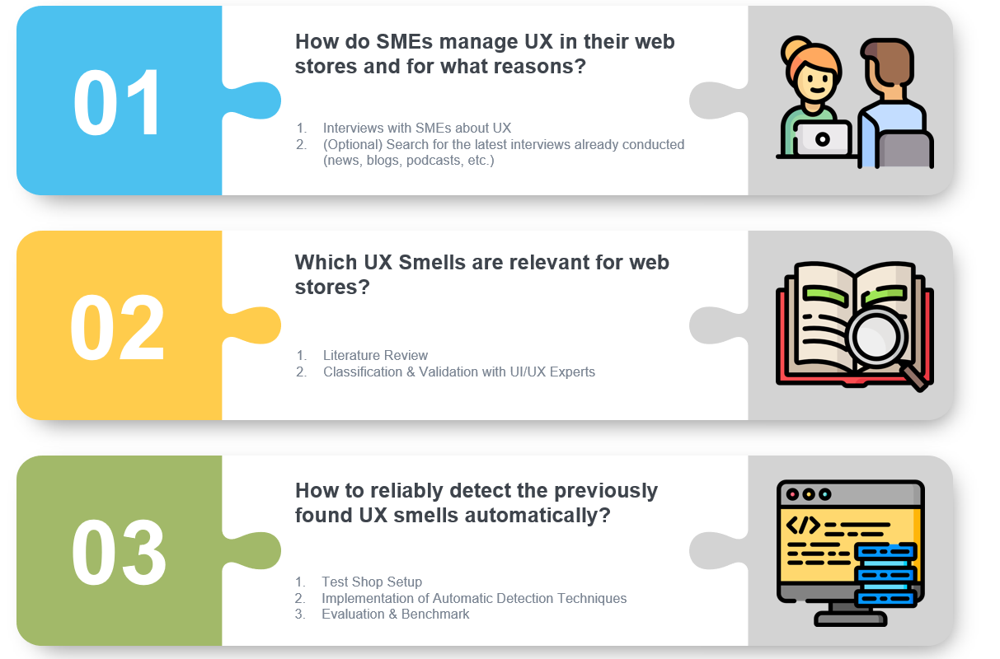

# Towards Automatically Detecting Causes of Negative User Experience in Web Stores

> This Bachelor thesis aims to automatically detect User Experience (UX) Smells in web stores. It takes place between March 2022 and September 2022.

## Research Objectives

- Explore the UX state in Small and Medium-sized Enterprises (SMEs).
- Identify UX anti-patterns relevant to web stores.
- Provide effective techniques to automatically detect some of the UX Smells previously found.

## Research Questions

- **RQ 1**: How do SMEs manage UX in their web stores and for what reasons?
- **RQ 2**: What are the UX Smells that are relevant for web stores?
- **RQ 3**: How to reliably detect the previously found UX Smells automatically?

## Research Process

The major phases can be found in the following table:

| Phase       | Time Frame   | Description |
| ----------- | ----------- | ----------- |
| Inquiry status UX at SMEs | April &#8594; May | Preparation, conduction and analysis of interviews with owners of web stores to inquire about the state of the UX and test the hypothesis. |
| Collecting and Validation UX Smells  | April &#8594; May | Literature research (incl. Grey) to collect the UX Smells, especially the ones relevant for web stores. Validation with UI/UX Experts. |
| Collecting user interaction data with a (test) web store | May &#8594; July | User interaction data with a (test) web store is collected and manually analyzed for the UX Smells |
| Development of techniques for automatic detection | May &#8594; July | After the manual analysis, prototype tools are developed and tested to automatically detect some UX anti-patterns based on the user behaviors represented in the recorded data. |
| Evaluation with a benchmark | July &#8594; August | The effectiveness of the developed prototype tool is evaluated by means of a benchmark.  |

## Research Artifacts and Results

- **RQ 1**: [Analysis of the Interviews](Interviews_Evaluation.md)
- **RQ 2**: [UX Smells Classification](Catalog_UX_Smells.md)
- **RQ 3**: [Process of UX Smell Detection](Process.md) & [Benchmark](Benchmark.md)