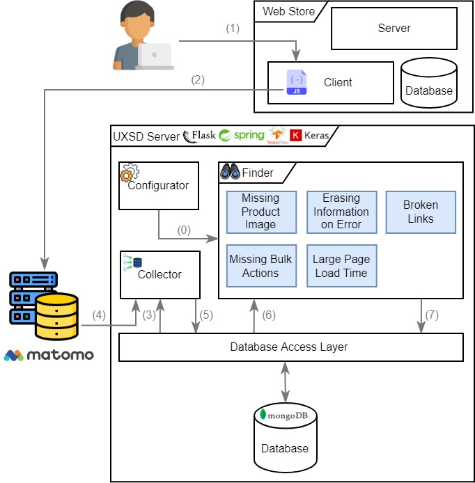

# Towards Automatically Detecting User Experience Smells in Web Stores

> This repository contains all information related to a bachelor thesis done at the University of Stuttgart by Mohamed Ben Salha. The author can be reached at the email **st167263@stud.uni-stuttgart.de**

The research objectives of this work are:

- Explore the UX state in Small and Medium-sized Enterprises (SMEs).
- Identify UX anti-patterns relevant to web stores.
- Provide effective techniques to automatically detect some of the UX Smells previously found.
  
leading to the next research questions (RQ):

- **RQ 1**: How do SMEs manage UX in their web stores and for what reasons?
- **RQ 2**: What are the UX Smells that are relevant for web stores?
- **RQ 3**: How to reliably detect the previously found UX Smells automatically?

resulting in the following results:

- **RQ 1**: [Analysis of the Interviews](Interviews_Evaluation.md)
- **RQ 2**: [UX Smells Classification](Catalog_UX_Smells.md)
- **RQ 3**: [Process of UX Smell Detection](Process.md) & [Benchmark](Benchmark.md)
  
This file goes into more detail about the folders and describes what the task of each is.

## [Organization & Research](Organization_and_Research)

This folder reflects the procedure adopted during this work.

- [Benchmark](Organization_and_Research/Benchmark.md) describes the setup and results of the benchmark conducted to test the effectiveness of the **UX** **S**mell **D**etector (UXSD).
- [Catalog of UX Smells](Organization_and_Research/Catalog_UX_Smells.md) presents the catalog of 25 UX Smells elaborated within the scope of this work. This catalog consists of five categories:
  - Visual Presentation
  - User Interaction
  - Lack of Transparency
  - Performance
  - Navigation
- [Evaluation of Interviews](Organization_and_Research/Interviews_Evaluation.md) provides the overview and the results of the interviews conducted with Small and Medium-sized Enterprises (SMEs) in order to inquiry the most current state how SMEs deal with UX.
- [Literature Research](Organization_and_Research/Literature_Research.md) informs about the methodology while doing the literature research and a few relevant papers.
- [Recognition Process](Organization_and_Research/Recognition_Prozess.md) describes the process of automatically detecting the UX Smells in Web Stores.
- [Study Design](Organization_and_Research/Study_Design.md) presents the research objectives, questions, results and artifacts.

## [Test Shop](Test_Shop)

Test store was created to substitute the lack of real store from the industry. To apply the please follow the instructions in the [README](Test_Shop/README.md). It was implemented with Angular and Flask.

## [UX Smell Detector (UXSD)](UX_Smell_Detector)

This folder has the source code for the detection techniques.

The [README](UX_Smell_Detector/README.md) in the folder serves to understand the detailed functionality and usage.

### Detailed Process

The process is illustrated in the following figure:

0. Configuration for the detection settings.
1. With Matomo already integrated, the user interacts with the online shop.
2. User interaction is stored in the Matomo servers.
3. The Collector fetches the last stored ID in the database.
4. The Collector retrieves the new recorded data from Matomo servers.
5. The Collector stores the fetched data in the database.
6. The Finder retrieves the raw data from the database.
7. After the Finder has analyzed the visits for the predefined smells based on the Configurator, it saves the UX smells found with the corresponding data in the database.  

